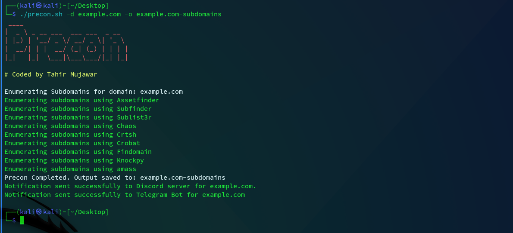

# Precon

Precon is a bash script designed to passively discover subdomains for websites using a variety of reconnaissance tools.With Precon, users can effortlessly enumerate subdomains, aiding in cybersecurity assessments and domain management.
everaging multiple tools such as assetfinder, subfinder, and amass, Precon ensures thorough subdomain enumeration.Users receive instant notifications upon completion of reconnaissance tasks, ensuring timely updates on subdomain discovery progress.
## Features




- Utilizes multiple reconnaissance tools including `assetfinder`, `subfinder`, `sublist3r`, `chaos`, `crtsh`, `crobat`, `findomain`, `knockpy`, and `amass` for comprehensive subdomain enumeration.

- Supports both single domain names and lists of domain names for reconnaissance tasks.

- Organizes and saves subdomain results into separate text files for each domain, facilitating easy analysis.

- Sends completion notifications to Discord and Telegram servers, enabling real-time updates on reconnaissance progress.

- Implements color-coded output and usage instructions for enhanced usability and readability.

- Developed by Tahir Mujawar, ensuring reliability and accountability in script maintenance and updates.


## Installation

```Install Precon 
  git clone https://github.com/hackytam/Precon.git
  cd Precon
  chmod +x Precon.sh
  ./Precon.sh -h
```
## Usage

```Bash script
./Precon.sh -h
```

This will display usage for the tool.
```

 ____                           
|  _ \ _ __ ___  ___ ___  _ __                                                     
| |_) | '__/ _ \/ __/ _ \| '_ \                                                    
|  __/| | |  __/ (_| (_) | | | |                                                   
|_|   |_|  \___|\___\___/|_| |_|                                                   
                                                                                   
# Coded by Tahir Mujawar

Precon is a subdomain discovery bash script that discovers subdomains for websites passively by using various Tools.
Usage: /usr/local/bin/precon.sh [options]

Options:
  -h, --help               Display this help message
  -d, --domain <name>      Specify a single domain name to enumerate it's subdomains
  -dL, --domain-list       Specify a file containing a list of domain names
  -o, --output <directory> Specify output directory

Example: /path/to/Precon/precon.sh -d example.com -o /path/to/output

```
Scan single domain 
```
./Precon.sh -d example.com -o example.com-output 
```
Scan domain list 
```
./Precon.sh -dL /path/to/domain/file -o /output/directory
```
## Notes
- Prior to executing the script, ensure the configuration of necessary API keys for the required tools.
- The commands associated with the specified tools are adaptable to suit individual preferences. 
- Execute the script with sudo privileges if any of the specified tools require root permissions.
- In the absence of an explicitly provided output filename, a directory named after the domain will be generated, housing the output.
- For enhanced accessibility, consider copying the script to '/usr/local/bin' or an alternate directory, facilitating execution from any location.
- The notation '> /dev/null 2>&1' effectively suppresses output for a streamlined execution experience.
## 🔗 Social Links
Follow me on 


<p align="center">
  <a href="https://www.linkedin.com/in/hackytam"></a>
  <a href="https://medium.com/@hackertam1"></a>
  <a href="https://twitter.com/hackytam"></a>
</p>
Made with ❤️ by Tahir Mujawar
